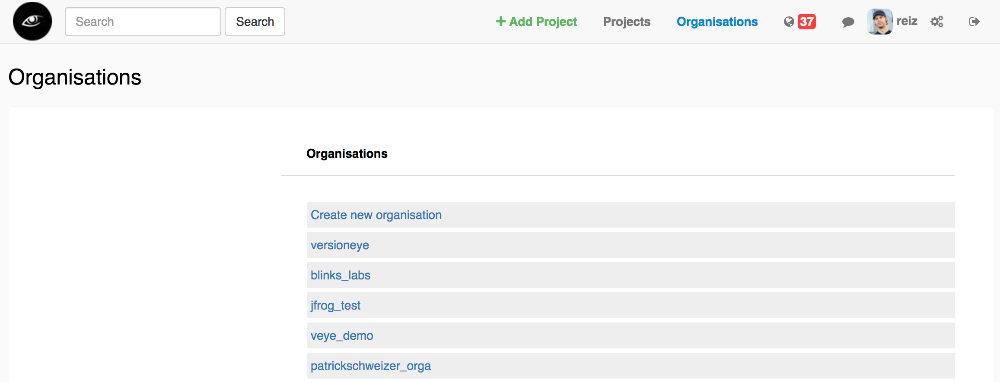

# VersionEye User Guide

This user guide explains how to use the VersionEye software as a user. 
If you wanna now how to setup the software you should check out the [ops_contrib](https://github.com/versioneye/ops_contrib) repository.

## Users

Everybody can sign up for free at [VersionEye.com](https://www.versioneye.com). Every user in the system has a: 

 - Username
 - Email
 - Password
 - List of organisations
 
After a successful signup of a new user, a new organisation is created to which the user is assigned to. The name of the new organisation follows always this pattern `#{username}_orga`.

If the software is running in `enterprise` mode, it can be configured that way that only admins of the system can create new organisations. 

## Organisations

An organisation is the entity for a work group. This entities are bound to an organisation:

 - Projects
 - Teams (users)
 - License whitelists
 - Component whitelists
 - Open Source Inventory List 
 - Subscription
 - API Key 
 - Billing Address

The entities above are never bound to a user directly. That has the advantage that the owernship can be transfered very easily. A user can be member in many organisations. 

In the main menu there is a point for "organisations". 
By clicking on that menu a list of all organisations is returned there the user is a member of. Here is an example: 

The first element in the list is a link to create a new organisation. 

